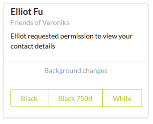

# Примеры манипуляции элементами и их свойствами

### Изменение фона страницы на примете стилизации body: <br/>

```javascript
function setBackgroundWithDuration(color, duration){
    d3.select("body")
        .transition()
        .duration(duration)
        .style("background-color", color);
}
```
call:
```javascript
setBackgroundWithDuration("black");
...
setBackgroundWithDuration("black", 750);
...
setBackgroundWithDuration("white");
```
***
### Изменение цвета текста на примере всех элементов p: <br/>

```javascript
function setTextColor(color, duration){
    d3.selectAll("p")
        .transition()
        .duration(duration)
        .style("color", color);
}
```
call
```javascript
setTextColor("red");
...
setTextColor("blue", 750);
...
setTextColor("black");
```
***
### Добавление текста в элемент div: <br/>

```javascript
function addTextToElement(text){
    d3.select("div[class=text]")
        .html(text);
}
```
call:
```javascript
addTextToElement("Hello, world!");
...
addTextToElement("");
```
***
### Создание и удаление элементов разметки: <br/>


create element:
```javascript
function addNewElement(){
    d3.select("div[class=elements]").append("p").text("New paragraph.");
}
```
delete all elements (variant 1):
```javascript
function deleteAllParentElements(){
    d3.select("div[class=elements]").html("");    // variant 1
}
```
delete all elements (variant 2):
```javascript
function deleteAllParentElements(){
    d3.select("div[class=elements]").selectAll("*").remove();   // variant 2
}
```
